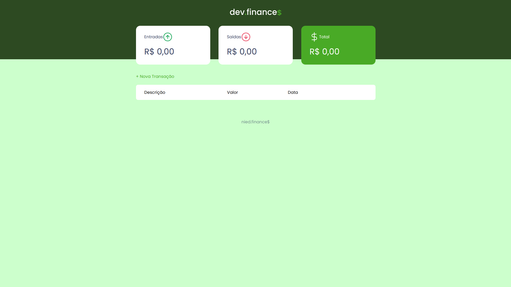
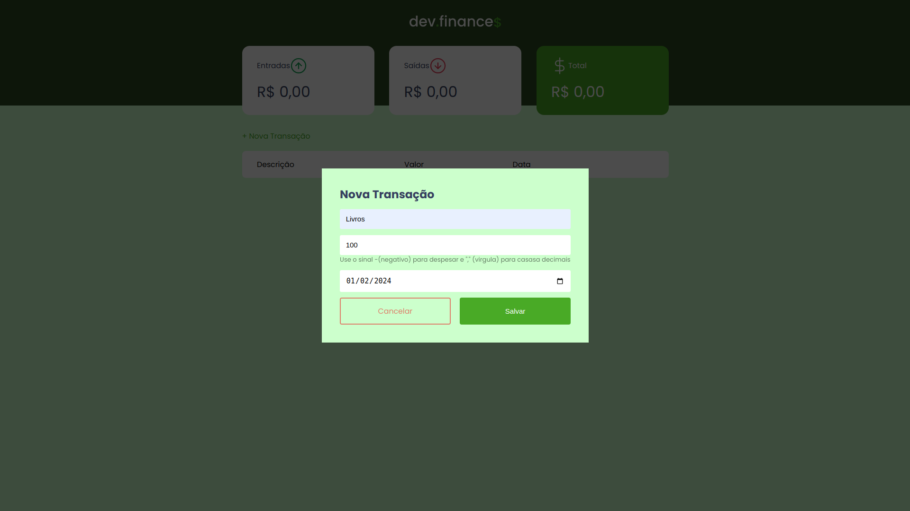
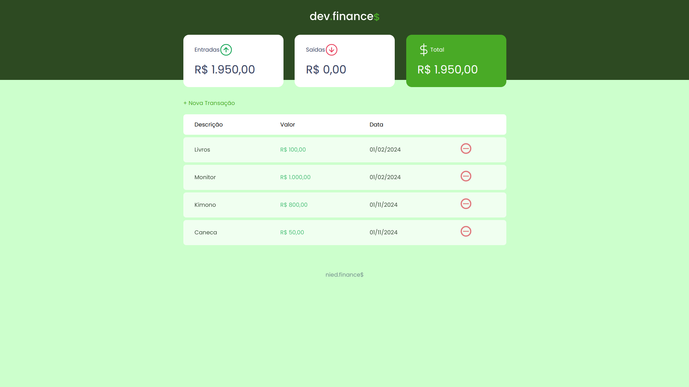

# Dev Finance 💰

Este projeto é uma aplicação de controle financeiro desenvolvida durante o da [Rocketseat](https://rocketseat.com.br/). A proposta é criar uma ferramenta simples e eficiente para o gerenciamento de finanças pessoais utilizando Html, Css E Javascript.

## Funcionalidades

- **Adição de Transações:** Registre suas despesas e receitas de forma rápida e fácil.
- **Visualização de Saldo:** Acompanhe o saldo total das suas transações.
- **Categorização:** Organize suas transações por categorias para uma análise mais detalhada.
- **Resumo Mensal:** Visualize um resumo mensal das suas finanças.

## Tecnologias Utilizadas

- **HTML5:** Estruturação da página.
- **CSS3:** Estilização da interface.
- **JavaScript:** Lógica de programação e interatividade.
- **LocalStorage** Persistência de dados.

Durante o desenvolvimento deste projeto, adquiri conhecimentos valiosos, incluindo:

- **Desenvolvimento Web:** Aprofundei meus conhecimentos em HTML, CSS e JavaScript.
- **Lógica de Programação:** Reforcei conceitos essenciais de lógica de programação na prática.
- **Organização de Código:** Aprimorei minhas habilidades na estruturação e organização de código fonte.
- **Interação com o DOM:** Aprendi a manipular o Document Object Model de forma eficiente.

**Visualização projeto**

